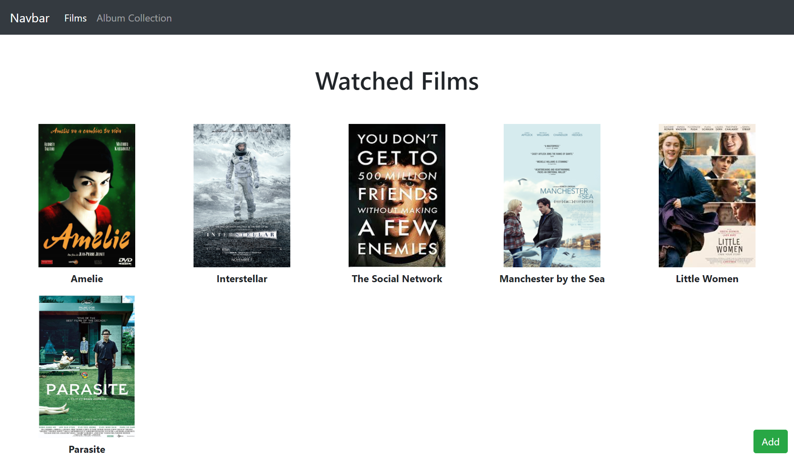
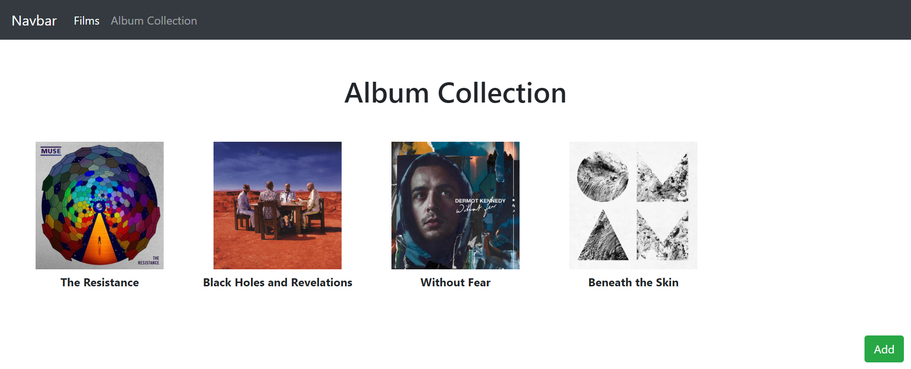
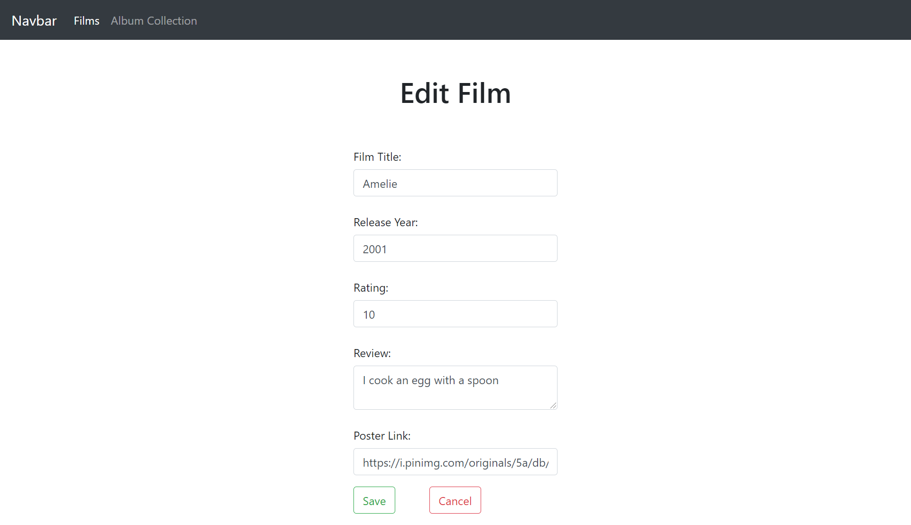
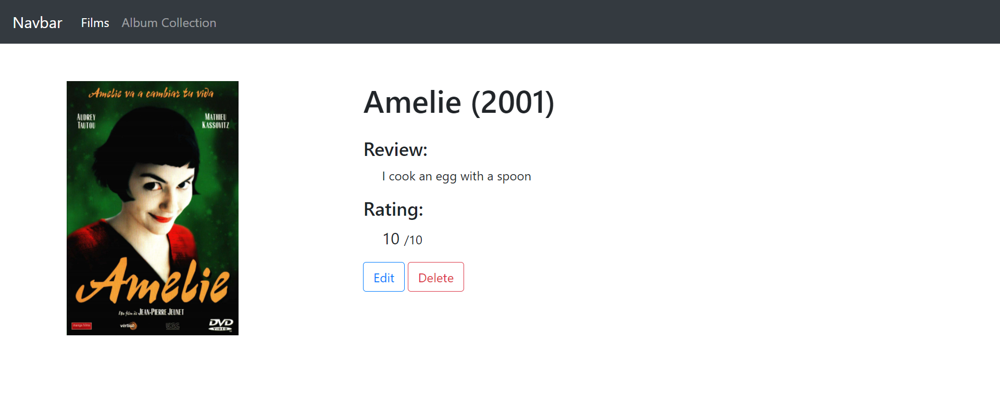

This was made to practice working with mongodb, express and node.

## Features

- User can "ADD" movie to their watched list.
- User can "DELETE" movie to their watched list.
- User can "EDIT" movie to their watched list.

## Screenshots

## Tools

- EJS
- Bootstrap
- Node
- ExpressJS
- MongoDB

## Environment Variables

- DB_URL (from MongoDB)
